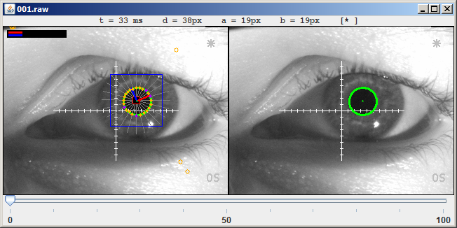

OctoEye
=======

Pupil tracking algorithm especially for the Octopus® 900 perimeter (Haag-Streit).

Dependencies
------------

* [JDK 1.7](http://www.oracle.com/technetwork/java/javase/downloads/jdk7-downloads-1880260.html)
* [OpenCV 2.4.9](http://opencv.org/)

How to run the example
----------------------

1. Extract example files: `cd data && tar xf 1.tar.xz`
2. Download OpenCV. Create a new folder called *lib*.
2.1. Windows: copy opencv-249.jar (including both x64 and x86 subdirectories) from *path-to-opencv/build/java* into your *lib* folder.
2.2. Mac OS X: todo
2.3. Linux: todo
3. Compile the source files. I'd suggest to create a new project using an IDE such as [IntelliJ](https://www.jetbrains.com/idea/)
3.1. In the new project, open *File > Project structure* and add opencv-249.jar to the libraries.
3.2. Edit run configuration. You will need a VM option: e.g. `-Djava.library.path="lib/x86"`. Add program arguments: `data/1`.

FAQ
---

1. What are these *raw files*?

   The Octopus 900 perimeter returns grayscale images as a byte sequence with a dimension of 320x240 px. So the *raw files* are just `byte[] foo = new byte[320*240*1]` saved to file.

2. What is *t*, *d*, *a* and *b* in the screenshot?

   *t*: needed time

    *d*: pupil diameter (okay, acutally it's 2*pupilMajorAxis)

    *a*: major axis of the pupil ellipse (red)

    *b*: minor axis of the pupil ellipse (red)

